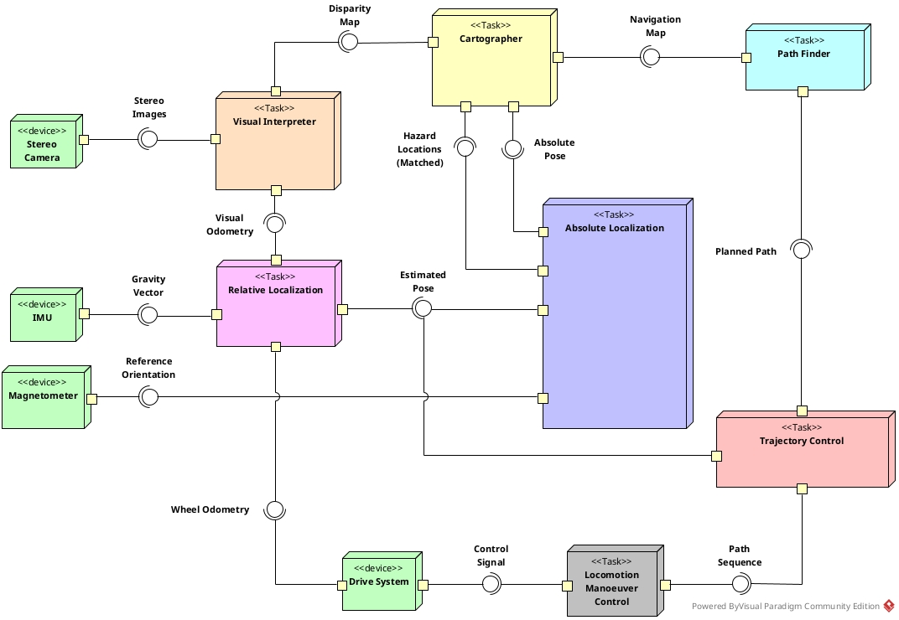
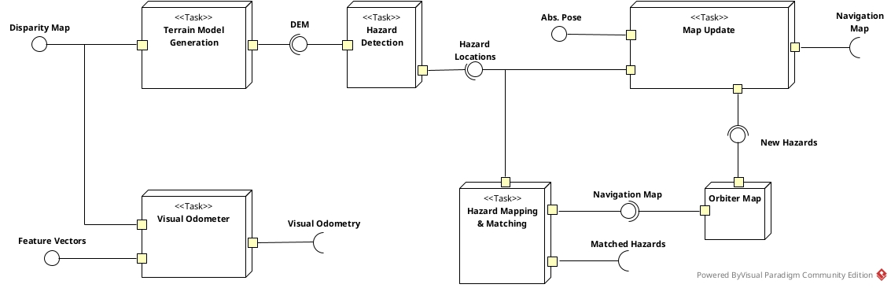

# 1. Table of Content
- [1. Table of Content](#1-table-of-content)
- [2. Implementation of GNC](#2-implementation-of-gnc)
  - [2.1. Architecture](#21-architecture)
  - [2.2. Component functionality](#22-component-functionality)
    - [2.2.1. Cartographer](#221-cartographer)
    - [2.2.2. Path Finder](#222-path-finder)
    - [2.2.3. Visual Interpreter](#223-visual-interpreter)
    - [2.2.4. Relative Localization](#224-relative-localization)
    - [2.2.5. Absolute Localization](#225-absolute-localization)
    - [2.2.6. Trajectory Control](#226-trajectory-control)

# 2. Implementation of GNC

This document will consist of two parts:
 - Architecture
 - Component functionality

## 2.1. Architecture

The whole GNC system is composed of following components:

| Component               | Description                               |
| ----------------------- | ----------------------------------------- |
| `Cartographer`          | Building the environment                  |
| `Path Finder`           | Running path finding algorithm            |
| `Visual Interpreter`    | Process visual information                |
| `Relative Localization` | Providing relative orientation & position |
| `Absolute Localization` | Providing absolute orientation & position |
| `Trajectory Control`    | Providing command signal to actuators     |

The next diagram depicts the deployment of the system, which is inspired by  [NEXT-GENERATION ROVER GNC ARCHITECTURES](https://www.semanticscholar.org/paper/Next-Generation-Rover-GNC-Architectures-Shaukat-Al-Milli/09c605aad30ad69d43e31f9450807e0d14598667).

## 2.2. Component functionality

### 2.2.1. Cartographer

### 2.2.2. Path Finder
### 2.2.3. Visual Interpreter
### 2.2.4. Relative Localization
### 2.2.5. Absolute Localization
### 2.2.6. Trajectory Control
